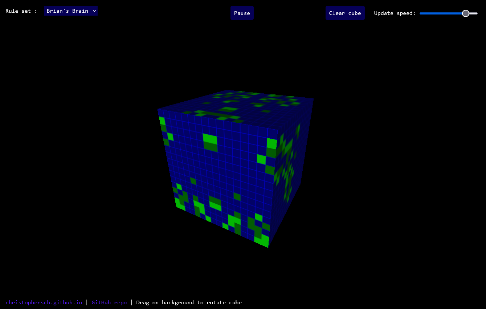
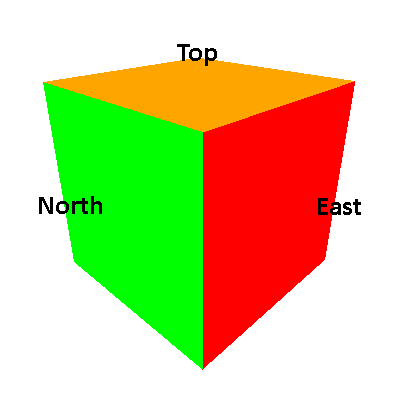
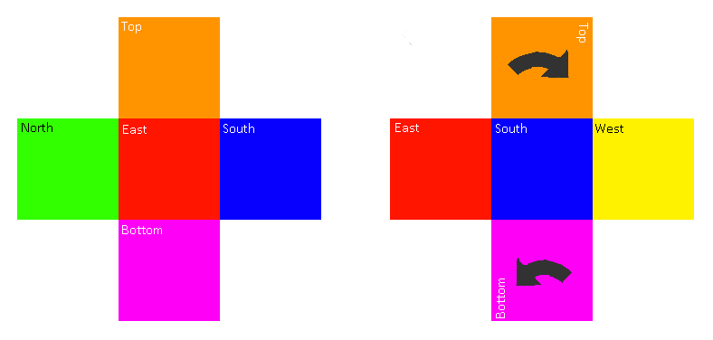

A cellular automata visualizer built over a cube's surface. Almost like a small planet for the little cells that live and die on it... 

Contains [Conway's Game of Life](https://en.wikipedia.org/wiki/Conway%27s_Game_of_Life) and [Brian's Brain](https://en.wikipedia.org/wiki/Brian%27s_Brain).

    </img>

# How it works

The main problem that needs to be tackled is how updates are handled along the cube's edges.
First, let's look at the cube's geometry and assign labels to each face:

    

Each face of the cube has four neighbors. Each of these can be assigned a 2D grid for the cellular automata. Then, when updating each face, we can stitch its neighboring faces together into one larger grid and iterate only over the central section. That way we can easily obtain an edge cell's neighbors from another face of the cube:

    

However, we can't just stitch neighbors together for all faces. If we go face by face, some neighbors have to be rotated in order to preserve the cube's topology:

    

To amend this, each face has a map that tells it which faces are its neighbors and how each of them should be rotated to preserve the cube's topology. Then, while stitching the faces together as explained above, each neighbor is rotated according to the map. 

The corner cells of each face carry a slight loss of generality, as they only have 7 neighbors as opposed to the usual 8. One effect of this is that gliders get destroyed if they fly into a corner :-(

## Libraries used:
- [Three.js](https://threejs.org/) (cube rendering & mouse pointer raycasting)
- [Array2D](https://github.com/matthewtoast/Array2D.js/) (grid rotations for updating along cube edges)